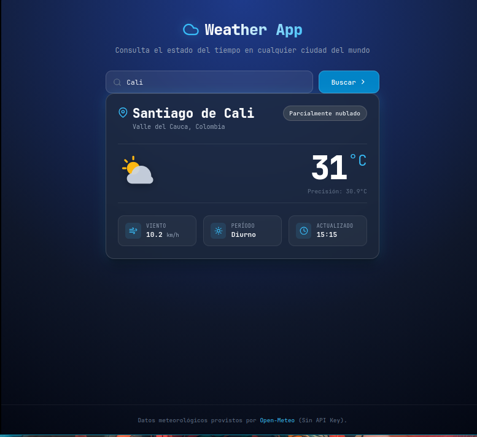

# Weather App (Vanilla Web)

Aplicación interactiva para la consulta del pronóstico meteorológico en tiempo real, desarrollada con tecnologías web vanilla. Impulsada por la API pública y gratuita de [Open-Meteo](https://open-meteo.com/).

---

## Resumen del Experimento

El objetivo era generar una aplicación web completa y sencilla que consumiera la API de Open-Meteo utilizando **la menor cantidad de prompts posible y casi cero interacción humana sobre el código**. Antigravity generó la aplicación con 2 errores evidentes, por lo que también aproveché para hacer comparativas de tiempos.

### Paso 1 - Recopilación en Obsidian

Recopilé los requisitos de la comanda y usé MiMo 2.5 Free (OpenCode en Plan Mode) para generar ideas sobre la estructura de carpetas, estilos y especificaciones técnicas. Todo se escribió directamente en un archivo de Obsidian como borrador para eliminar redundancias y preparar el siguiente prompt.

### Paso 2 - Estructuración con Gemini

Envié el borrador de Obsidian a Gemini Flash 3.6 para que lo ordenara y diera forma al [prompt inicial](prompts/01-prompt-inicial.md) optimizado para Antigravity.

### Paso 3 - Generación con Antigravity

Copié el prompt completo y lo pegué en Antigravity (Gemini Flash 3.8 high). La aplicación se generó con dos bugs evidentes.

### Paso 4 - Inspección y detección de bugs

Usé Vite para visualizar la web en tiempo real y las DevTools de Firefox para inspeccionar el DOM y CSS
- Bug N1 (lógico): Spinner de carga permanece visible
- Bug N2 (visual): Espaciado de card y footer faltante

### Paso 5 - Corrección de bugs

Cada bug se trató de forma diferente:
- **Bug N1**: Usé Nemotron 3 Ultra Free (OpenCode) para diagnosticar → generó prompt → envié a Antigravity → corrigió (~15 min)
- **Bug N2**: Corrección manual con DevTools + nvim (~3 min)

---

## Herramientas Utilizadas

| Modelo                      | Plan     | Costo | Rol                | Qué hizo                                      |
| --------------------------- | -------- | ----- | ------------------ | --------------------------------------------- |
| **MiMo 2.5 Free**           | Gratuito | $0    | Apoyo (prompts)    | Definió estructura de carpetas y estilos      |
| **Gemini Flash 3.6**        | Gratuito | $0    | Apoyo (prompts)    | Estructuró requisitos y ordenó prompts        |
| **Nemotron 3 Ultra Free**   | Gratuito | $0    | Apoyo (inspección) | Diagnosticó el Bug N1                         |
| **Gemini Flash 3.8 (high)** | Gratuito | $0    | Motor principal    | Generó la app (Antigravity) y corrigió Bug N1 |

**Costo total del experimento: $0 USD**

**Herramientas complementarias:**
- **Vite** - Servidor de desarrollo para visualizar la web en tiempo real
- **Firefox DevTools** - Inspección del DOM y CSS en el navegador.
- **nvim** - Editor de código.

> Este proyecto costó **$0 USD**. Todos los modelos utilizados son gratuitos. Ver comparativa completa de precios y tiempos: [comparativa.md](comparativa.md)

---

## Prompt Inicial

> El prompt completo que se envió a Antigravity para generar la aplicación.

Ver: [prompts/01-prompt-inicial.md](prompts/01-prompt-inicial.md)

---

## Bugs Encontrados

### Bug N1 - Spinner de carga permanece visible (Lógico)

**Problema**: El spinner de carga estaba permanentemente visible y no desaparecía después de buscar una ciudad.

**Qué hice**: Usé Nemotron Ultra a través de OpenCode en Plan Mode para inspeccionar el código con el mínimo contexto posible. El objetivo era probar si el modelo podía reconocer la estructura completa del proyecto sin explicaciones extensas. Nemotron identificó el problema y generó un prompt de solución para Antigravity.

**Resultado**: Antigravity corrigió el bug lógico refactorizando el manejo de estados asíncronos.

Ver prompt de inspección y solución: [prompts/02-bug-n1-inspeccion.md](prompts/02-bug-n1-inspeccion.md)

---

### Bug N2 - Correcciones Manuales (Visual)

**Problema**: La tarjeta del clima quedaba muy pegada al header y faltaba el footer.

**Qué hice**: Correcciones manuales directas. No valía la pena gastar tokens en algo tan simple cuando el núcleo de la aplicación estaba terminado.

**Resultado**:
- Agregué `margin-top: 2rem` a la card para un espaciado correcto
- Agregué el footer al HTML
- Estilicé el footer manualmente con CSS
- Enlacé correctamente el footer

Ver detalle: [prompts/03-bug-n2-correccion-manual.md](prompts/03-bug-n2-correccion-manual.md)

---

## Resultado Final

La aplicación resultante cumple con todos los requisitos: búsqueda de ciudades, visualización del clima en tiempo real, manejo de estados y diseño responsive.

